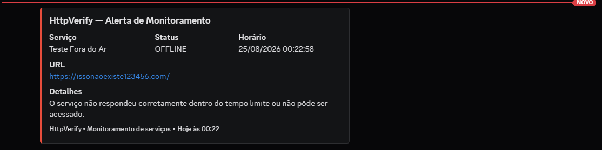

# HttpVerify

Monitor simples de disponibilidade HTTP desenvolvido em Python.

O HttpVerify verifica serviços em intervalos definidos, mede o tempo de resposta, registra eventos em log e envia alertas para o Discord quando um serviço apresenta falha.

## Funcionalidades

* Monitoramento periódico de URLs
* Verificação de status HTTP
* Medição de latência
* Logging em arquivo
* Alertas via Discord Webhook
* Configuração por `.env`
* Carregamento opcional de serviços por API
* Fallback para serviços configurados localmente

## Fluxo

```text
Serviço → Requisição HTTP → Status
                         ├─ OK
                         └─ Falha → Log + Discord
```

## Configuração

Instale as dependências:

```bash
pip install -r requirements.txt
```

Crie um `.env` na raiz:

```env
DISCORD_WEBHOOK_URL=sua_url_do_webhook
API_PROJECTS_URL=
```

`API_PROJECTS_URL` é opcional. Sem ela, os serviços são carregados de `SERVICES` no código.

> Não versione o arquivo `.env`.

### Serviços

```python
SERVICES = [
    {
        "name": "Meu Portfólio",
        "url": "https://devantonio.com.br"
    },
    {
        "name": "Google",
        "url": "https://google.com"
    }
]
```

### API de serviços

Quando configurada, a API deve retornar:

```json
[
    {
        "name": "Tasky",
        "url": "https://tasky.com"
    }
]
```

Se a API falhar, o monitor utiliza a lista local como fallback.

## Execução

```bash
python HttpVerify.py
```

Configuração padrão:

```python
TIMEOUT = 5
CHECK_INTERVAL = 300
```

Isso representa um timeout de 5 segundos por requisição e uma nova verificação a cada 5 minutos.

## Discord

Os alertas são enviados em formato Embed com as principais informações da ocorrência.



## Logs

Os eventos são registrados em:

```text
httpverify.log
```

O arquivo mantém os detalhes técnicos das falhas para diagnóstico.

## Tecnologias

* Python
* Requests
* python-dotenv
* Discord Webhook
* Logging


[devantonio.com.br](https://devantonio.com.br)
